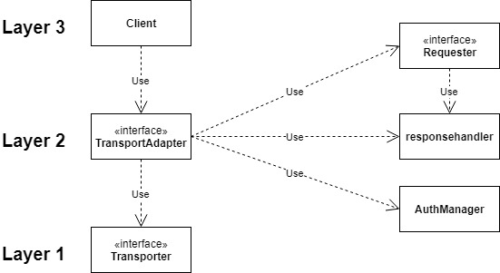

# DeviceHive SDK for GO

Generally Golang SDK for DeviceHive consists of 2 APIs, feel free to choose yours:
- client (a.k.a. high-level client) — provides synchronous API and ORM-like access to DeviceHive models
- WS client (a.k.a. WS low-level client) — provides asynchronous API: just sends the request and returns an error only in case of request error,
all raw response data and response errors are written to appropriate channels which are created after WS connection is established
(for more details see [documentation](#documentation))

## Installation

    go get -u github.com/devicehive/devicehive-go

## Documentation
Visit https://godoc.org/github.com/devicehive/devicehive-go for full API reference.

## Usage
### Connection

    import (
        "github.com/devicehive/devicehive-go"
        "fmt"
    )

    func main() {
        client, err := devicehive_go.ConnectWithCreds("ws://devicehive-address.com/api/websocket", "login", "password")
        // OR
        client, err := devicehive_go.ConnectWithToken("ws://devicehive-address.com/api/websocket", "jwt.Access.Token", "jwt.Refresh.Token")
        if err != nil {
            fmt.Println(err)
            return
        }
    }

### Device creation

    import (
    	"github.com/devicehive/devicehive-go"
    	"fmt"
    )

    func main() {
    	client, err := devicehive_go.ConnectWithCreds("ws://devicehive-address.com/api/websocket", "login", "password")
    	if err != nil {
    		fmt.Println(err)
    		return
    	}

    	device, err := client.PutDevice("my-device1", "", nil, 0, 0, false)
    	if err != nil {
    		fmt.Println(err)
    		return
    	}

    	fmt.Println(device)
    }

### Command insert subscription

    import (
        "github.com/devicehive/devicehive-go"
        "fmt"
        "time"
    )

    func main() {
        client, err := devicehive_go.ConnectWithCreds("ws://devicehive-address.com/api/websocket", "login", "password")
        if err != nil {
            fmt.Println(err)
            return
        }

        device, err := client.GetDevice("my-device")
        if err != nil {
            fmt.Println(err)
            return
        }

        subscription, err := device.SubscribeInsertCommands(nil, time.Time{})
        if err != nil {
            fmt.Println(err)
            return
        }

        for command := range subscription.CommandsChan {
            fmt.Println(command)
        }
    }

## Running tests
Integration tests of high-level DH client:

    go test github.com/devicehive/devicehive-go/integrationtest/dh -serverAddress ws://devicehive-api.com/ -accessToken your.accessToken -refreshToken your.accessToken -userId 123

Integration tests of low-level DH WS client (only ws:// URL is acceptable for this tests as server address):

    go test github.com/devicehive/devicehive-go/integrationtest/dh_wsclient -serverAddress ws://devicehive-api.com/ -accessToken your.accessToken -refreshToken your.accessToken -userId 123

Unit tests:

    go test github.com/devicehive/devicehive-go/test/...

## Technical description
### Overview
There are three layers under the hood of DeviceHive Go SDK: Client layer, Transport adapter layer and Transport layer.

 
**Client** layer is responsible for all high level business logic (request parameters, models etc.). It knows nothing about protocol in use.  
**Transport adapter** layer orchestrates a few components:
- *Transport* (Transporter interface on diagram): low level component
- *AuthManager*: responsible for token creation; holds credentials, used for tracking last token refresh and authentication
- *Requester*: responsible for composing request data, URLs for HTTP and actions for WS, handles responses using *responsehandler* package
- *responsehandler*: parses responses and returns payload in common format

Transport adapter has two implementations so far: WSAdapter and HTTPAdapter.  
**Transport** layer is responsible for doing basic requests and subscriptions. Has two implementations: WS and HTTP.
### Resolving request resources
Since DeviceHive Go SDK supports HTTP and WS through single interface there is the mapping between custom resource names and URL pattern (for HTTP) or action (for WS). Similar mapping is present for response parsing.
### Subscriptions
Each layer (Client, Transport adapter and Transport) handles subscriptions in some way so there is a pipeline constructed from 3 go routines, one on each level.
The generic functionality for subscriptions is implemented on Transport layer.
In case of WS connection Transport just sends subscription request and then sends each message with subscription ID to corresponding subscription channel. In case of HTTP it creates go routine with polling for each subscription.  
On Transport adapter layer there is another go routine for each subscription to parse and transform subscription data, identify errors. Finally on Client layer there is go routine for each subscription to populate models with raw JSON data and send that object to client-facing channel.
